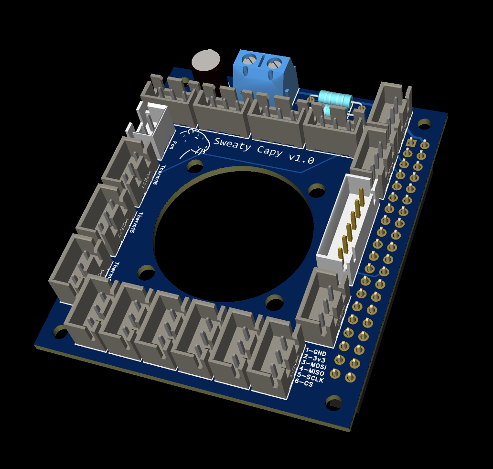

# SweatyCapy v1.0



**SweatyCapy** is a Raspberry Pi "hat" accessory for [Klipper](https://www.klipper3d.org/)-based 3D printers. It solves a common problem: running out of thermistor ports on your printer mainboard. By using the Raspberry Pi itself as a secondary Klipper MCU and the Dallas 1-Wire protocol, SweatyCapy adds **16 DS18B20 digital temperature sensor ports** to any Klipper printer — no extra MCU, no USB port, and no CAN bus required.

It was inspired by [mallcop's excellent write-up on the VORON Design forum — *"Adding a temperature sensor when you're out of thermistor ports"*](https://forum.vorondesign.com/threads/adding-a-temperature-sensor-when-youre-out-of-thermistor-ports.186/) (with contributions from Blargedy and yenda), which demonstrates wiring a single DS18B20 to the Pi's GPIO header. SweatyCapy takes that concept and turns the hand-soldered helper board yenda suggested into a proper, fan-cooled, 16-port PCB. Full credit to the original authors for the idea and the Klipper setup procedure.

...and by a friendly capybara named **Schlonky**, who had a very hot summer in 2026. 

## Features

| Feature | Details |
|---|---|
| **16× thermistor ports** | 3-pin JST connectors for DS18B20 Dallas 1-Wire digital temperature probes (GND / 3V3 / Signal) |
| **Dual 1-Wire buses** | Ports are split across two buses (8 sensors each), each with its own 4.7 kΩ pull-up resistor — keeps bus loading well under the practical device limit. Bus S1 (Therm 1–8) → physical pin 5 (GPIO 3); bus S2 (Therm 9–16) → physical pin 7 (GPIO 4) |
| **5 V screw terminal** | Power input for the Raspberry Pi via the GPIO header |
| **3010 5 V cooling fan** | 2-pin fan header with a matching 30 mm cutout in the board; the fan may be powered externally if desired |
| **6-pin JST expansion port** | SPI breakout for an ADXL345 accelerometer (input shaping) or other SPI devices |
| **HAT form factor** | ~56 × 65 mm board with a full 40-pin GPIO header and Pi-standard mounting holes |
| **Bulk decoupling** | 47 µF capacitor on the 5 V rail |

## ADXL / SPI Port Pinout

| Pin | Signal |
|---|---|
| 1 | GND |
| 2 | 3V3 |
| 3 | MOSI |
| 4 | MISO |
| 5 | SCLK |
| 6 | CS |

## How It Works

DS18B20 sensors are *digital* thermistors that communicate over the Dallas 1-Wire protocol. The Raspberry Pi natively supports 1-Wire via the `w1-gpio` device tree overlay, and Linux automatically enumerates every sensor on the bus with a unique serial number (`28-xxxxxxxxxxxx`). Because each sensor is individually addressed, many sensors share the same bus wires — SweatyCapy simply breaks that bus out into tidy, labeled connectors with proper pull-ups.

Klipper reads the sensors through its [RPi microcontroller](https://www.klipper3d.org/RPi_microcontroller.html) feature, so the Pi acts as a secondary MCU alongside your printer mainboard.

## Setup

Follow the [original forum guide](https://forum.vorondesign.com/threads/adding-a-temperature-sensor-when-youre-out-of-thermistor-ports.186/) for full details. In brief:

1. **Install the Pi as a Klipper MCU** (skip if already done for an ADXL):

   ```sh
   sudo service klipper stop
   cd ~/klipper
   make menuconfig   # set "Microcontroller Architecture" to "Linux process"
   make flash
   sudo service klipper start
   ```

2. **Enable the 1-Wire overlays** — add to `/boot/config.txt` (one line per bus):

   ```sh
   dtoverlay=w1-gpio,gpiopin=3  # bus S1 (Therm 1–8, physical pin 5)
   dtoverlay=w1-gpio,gpiopin=4  # bus S2 (Therm 9–16, physical pin 7)
   ```

   Reboot afterwards. Notes:
   - SweatyCapy has **onboard 4.7 kΩ pull-ups**, so the software pull-up script from the original post is *not* needed.
   - Bus S1 uses GPIO 3 (SCL1), so **I²C1 must remain disabled** (`dtparam=i2c_arm=off`, which is the Raspberry Pi OS default). Don't stack an I²C device on this pin.

3. **Find your sensors:**

   ```sh
   ls /sys/bus/w1/devices/
   # 28-0300a279b4db  28-0316a2791c28  w1_bus_master1 ...
   ```

4. **Add them to `printer.cfg`:**

   ```ini
   [mcu rpi]
   serial: /tmp/klipper_host_mcu

   [temperature_sensor chamber]
   sensor_type: DS18B20
   sensor_mcu: rpi
   serial_no: 28-0300a279b4db   ; use YOUR sensor's ID

   [temperature_sensor bed_frame]
   sensor_type: DS18B20
   sensor_mcu: rpi
   serial_no: 28-0316a2791c28   ; use YOUR sensor's ID
   ```

## Important Notes & Limitations

- **Do not use DS18B20 sensors to control heaters.** The 1-Wire bus is slow (roughly 1 reading/second/sensor) — use these for monitoring chamber, stepper, PSU, or electronics-bay temperatures, not for closed-loop heater safety.
- DS18B20 sensors are rated to **125 °C max** — plenty for chamber/ambient monitoring, unsuitable for hotends or high-temp beds.
- Buy the **pre-potted waterproof probe** style DS18B20s, not bare TO-92 parts, for easy mounting.
- Power the Pi **either** through the SweatyCapy screw terminal **or** its USB-C port — not both.

## Repository Contents

| Path | Description |
|---|---|
| [Gerber/](Gerber/) | Full fabrication output (EasyEDA Pro): copper, silkscreen, solder mask, outline, drill, and flying-probe test files |
| [SweatyCapy-Gerber.zip](SweatyCapy-Gerber.zip) | Zipped Gerbers, ready to upload to a board house |
| [Schematic.pdf](Schematic.pdf) | Schematic (v1.0, single A4 sheet) |
| [PCBImage.png](PCBImage.png) | 3D render of the assembled board |
| [BOM.md](BOM.md) | Generic bill of materials |

## Credits

- **Concept & Klipper procedure:** [mallcop](https://forum.vorondesign.com/members/mallcop.95/), with photos by [Blargedy](https://forum.vorondesign.com/members/blargedy.1466/) and multi-sensor bus design notes by [yenda](https://forum.vorondesign.com/members/yenda.35/) — [original thread on the VORON Design forum](https://forum.vorondesign.com/threads/adding-a-temperature-sensor-when-youre-out-of-thermistor-ports.186/)

